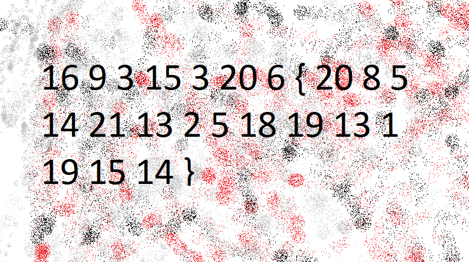

# Cylab - The Numbers

| Info         | Detalhe                |
|--------------|--------------------------|
| Plataforma   | picoCTF            |
| Categoria    | Cryptography             |
| Dificuldade  | Easy                     |
| Status       | ✅ Resolvido              |

## Sumário
- [Cylab - The Numbers](#cylab---the-numbers)
  - [Sumário](#sumário)
  - [Desafio](#desafio)
  - [Análise](#análise)
  - [Resolução](#resolução)
  - [Flag](#flag)
  - [Lições aprendidas](#lições-aprendidas)

---

## Desafio

> The numbers... what do they mean?

O desafio forneceu a seguinte sequência de números:



```
16 9 3 15 3 20 6 { 20 8 5 14 21 13 2 5 18 19 13 1 19 15 14 }
```

---

## Análise

A dica *"the numbers... what do they mean?"* combinada com uma sequência de números, chaves e o formato geral `algo{...}` (padrão de flag do picoCTF) sugeriu fortemente uma **cifra de substituição simples letra-por-número**, onde cada número representa a posição de uma letra no alfabeto:

```
a=1, b=2, c=3, d=4, e=5, f=6, g=7, h=8, i=9, j=10, k=11, l=12, m=13,
n=14, o=15, p=16, q=17, r=18, s=19, t=20, u=21, v=22, w=23, x=24, y=25, z=26
```

---

## Resolução

Convertendo cada número de volta para sua letra correspondente:

| Números | Letras |
|---------|--------|
| 16 9 3 15 3 20 6 | p i c o c t f |
| 20 8 5 14 21 13 2 5 18 19 13 1 19 15 14 | t h e n u m b e r s m a s o n |

Juntando tudo (mantendo o `{` e `}` como estão, já que não são letras):

```
picoctf{thenumbersmason}
```

---

## Flag

```
picoctf{thenumbersmason}
```

---

## Lições aprendidas

- Sempre que um desafio apresenta uma sequência de números pequenos (geralmente na faixa de 1 a 26) junto de uma tag de criptografia, uma substituição simples por posição no alfabeto é uma das primeiras coisas a se tentar.
- Reconhecer o formato da flag (`algo{...}`) ajuda a confirmar quais partes da sequência são caracteres literais (como `{` e `}`) e quais precisam ser decodificadas.
- Cifras clássicas/básicas como essa são comuns como ponto de entrada fácil em CTFs, servindo para introduzir reconhecimento de padrões antes de avançar para esquemas criptográficos mais complexos.
