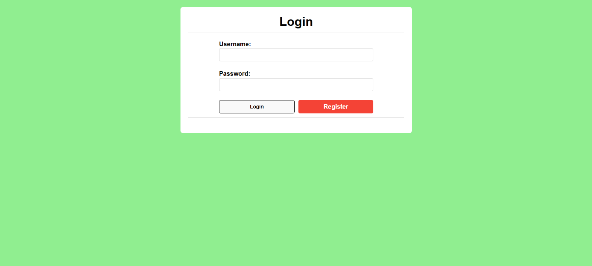
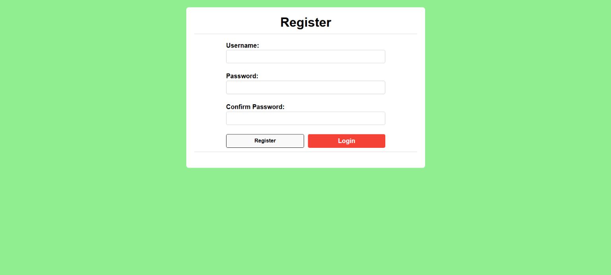
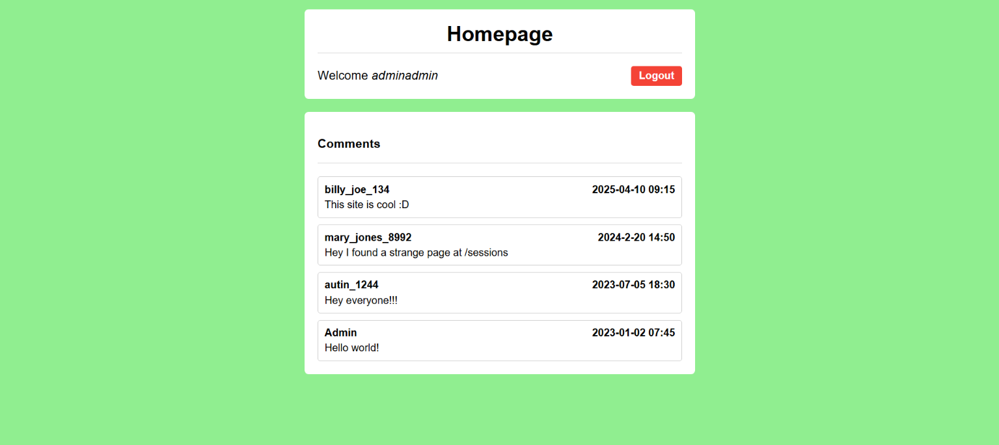
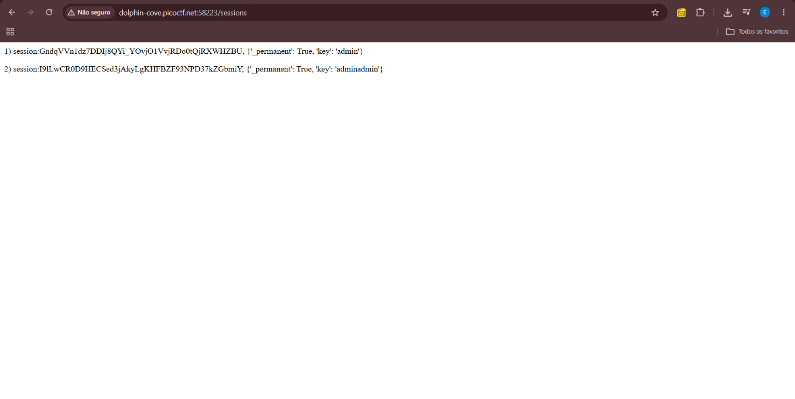
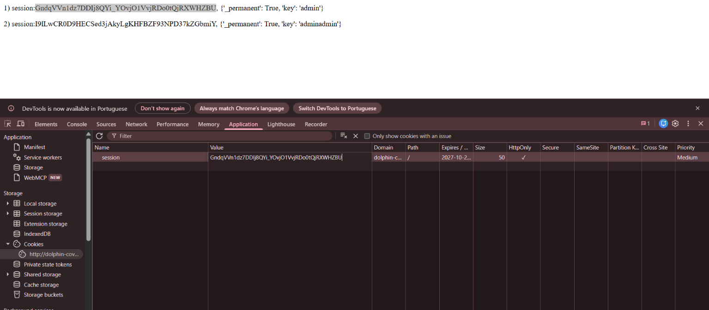
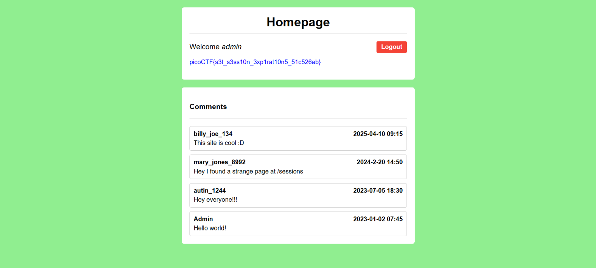

# Cylab - Old Sessions

| Info         | Detalhe                     |
|--------------|------------------------------|
| Plataforma   | picoCTF                     |
| Categoria    | Web Exploitation             |
| Vulnerabilidade | Gerenciamento de sessão quebrado |
| Status       | ✅ Resolvido                 |

## Sumário
- [Cylab - Old Sessions](#cylab---old-sessions)
  - [Sumário](#sumário)
  - [Visão geral](#visão-geral)
  - [Recon](#recon)
  - [Descoberta](#descoberta)
  - [Exploitation](#exploitation)
  - [Flag](#flag)
  - [Lições aprendidas](#lições-aprendidas)

---

## Visão geral

Controles adequados de expiração de sessão são essenciais para a segurança de contas de usuário. Se um usuário faz login em um computador público ou compartilhado e não faz logout explicitamente (apenas fecha a aba do navegador), e a expiração da sessão estiver mal configurada, a sessão pode permanecer ativa indefinidamente.

Isso permite que um atacante usando o mesmo navegador posteriormente acesse a conta do usuário sem precisar de credenciais, explorando o fato de que a sessão nunca expira e continua autenticada.

---

## Recon

Iniciei a instância e, ao acessar o site, me deparei com uma tela de login:



Cliquei em **Registrar** para criar uma nova conta:



Criei uma conta teste e loguei:



---

## Descoberta

A primeira coisa notável foi um comentário do usuário `mary_jones_8992` mencionando uma página estranha em `/sessions`. Fui investigar:



O endpoint `/sessions` expunha uma lista de sessões ativas, incluindo a minha própria — cada entrada continha um token de sessão e seus dados de usuário associados (ex: `'key': 'admin'`). Isso confirmou que os tokens de sessão de **outros usuários logados** (incluindo uma conta `admin`) estavam sendo vazados em uma página publicamente acessível.

---

## Exploitation

Com os tokens de sessão vazados em mãos, abri o DevTools do navegador e naveguei até **Application → Cookies**, então substituí o valor do meu próprio cookie `session` pelo token pertencente ao usuário `admin` (a primeira entrada da lista de `/sessions`):



Após alterar o cookie, voltei para a homepage. A aplicação agora me reconhecia como o usuário `admin`, e a flag foi exibida diretamente na página:



---

## Flag

```
picoCTF{s3t_s3ss10n_3xp1rat10n5_51c526ab}
```

---

## Lições aprendidas

- Tokens de sessão nunca devem ser expostos em um endpoint publicamente acessível — vazá-los é funcionalmente equivalente a vazar senhas.
- Sessões devem sempre ter uma política de expiração adequada; sessões que nunca expiram aumentam drasticamente a janela de oportunidade para sequestro de sessão, especialmente em dispositivos compartilhados ou públicos.
- Cookies do lado do cliente devem ser tratados como entrada não confiável pelo servidor — mas, do ponto de vista de um atacante, são um caminho direto para se passar por outro usuário se não forem protegidos por camadas adicionais (ex: vincular a sessão a IP/fingerprint do dispositivo, expiração curta, geração segura e aleatória).
