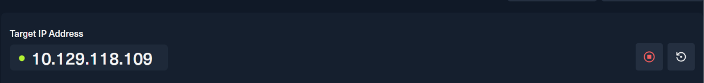
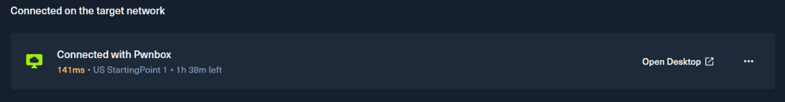
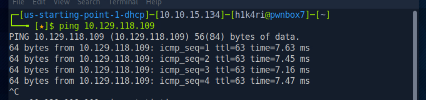
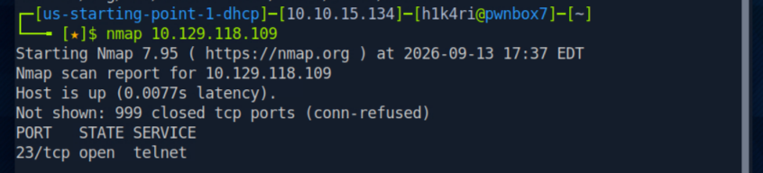
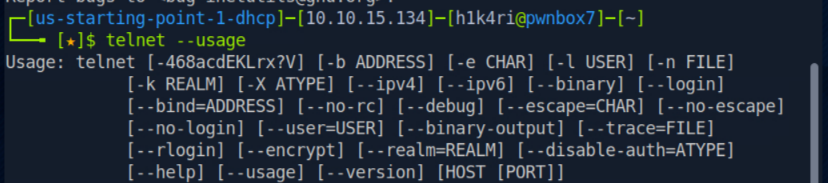
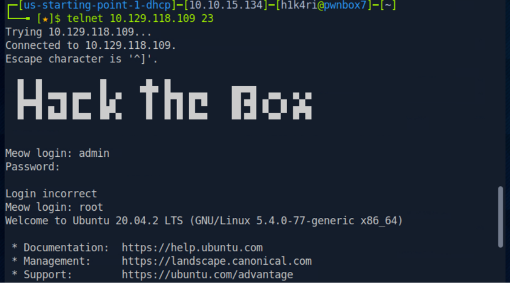
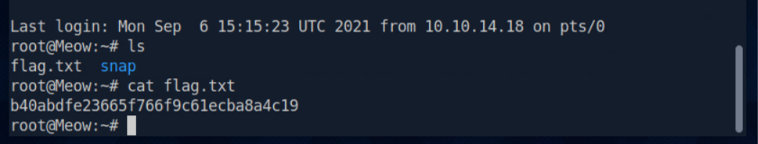

# HTB - Starting Point - Meow

🇺🇸 [English version](./README.md)

| Info        | Detalhe             |
|-------------|----------------------|
| Plataforma  | Hack The Box         |
| Track       | Starting Point       |
| Dificuldade | Muito Fácil          |
| OS          | Linux                |
| Status      | ✅ Resolvido          |

## Sumário
- [HTB - Starting Point - Meow](#htb---starting-point---meow)
  - [Sumário](#sumário)
  - [Recon](#recon)
    - [Teste de conectividade](#teste-de-conectividade)
  - [Enumeration](#enumeration)
  - [Exploitation](#exploitation)
  - [Flag](#flag)
  - [Lições aprendidas](#lições-aprendidas)

---

## Recon

Iniciei a máquina alvo pela plataforma do HTB, obtendo o endereço de IP do target:



**IP do alvo:** `10.129.118.109`

Em seguida, conectei na Pwnbox (máquina de ataque fornecida pelo HTB) e, através dela, me conectei na rede do target via VPN:



Copiei o IP do alvo (via clipboard) para usar diretamente no terminal da Pwnbox.

### Teste de conectividade

Para confirmar que o alvo estava acessível, rodei um `ping`:

```bash
ping 10.129.118.109
```



O host respondeu normalmente, confirmando que a máquina estava online e acessível pela rede da VPN.

---

## Enumeration

Com a conectividade confirmada, rodei um scan com o **Nmap** para identificar portas e serviços abertos no alvo:

```bash
nmap 10.129.118.109
```



Apenas a porta **23/tcp (telnet)** estava aberta no alvo.

Como não tinha certeza de como interagir corretamente com o serviço, consultei a ajuda do comando telnet:

```bash
telnet --usage
```



Isso mostrou que é possível se conectar diretamente informando o IP e a porta do serviço.

---

## Exploitation

Conectei ao alvo usando telnet na porta 23:

```bash
telnet 10.129.118.109 23
```



Testei inicialmente uma credencial genérica:

- **Usuário:** `admin` / **Senha:** `admin` → ❌ Login incorreto

Em seguida, tentei o usuário padrão de administrador em sistemas Linux:

- **Usuário:** `root` → ✅ Login bem-sucedido (sem exigir senha)

Após o acesso, listei os arquivos do diretório atual e li a flag:

```bash
ls
cat flag.txt
```



---

## Flag

```
b40abdfe23665f766f9c61ecba8a4c19
```

---

## Lições aprendidas

- Telnet é um protocolo de texto claro (sem criptografia), o que já o torna um risco de segurança por si só.
- A ausência de senha para o usuário `root` é uma falha crítica de configuração — reforça a importância de nunca deixar contas privilegiadas sem autenticação forte.
- Reforça a importância de sempre enumerar portas e serviços antes de tentar qualquer exploração.
